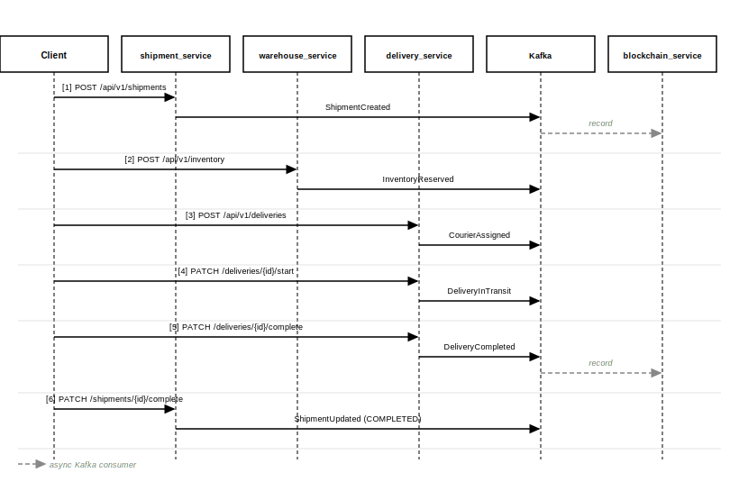
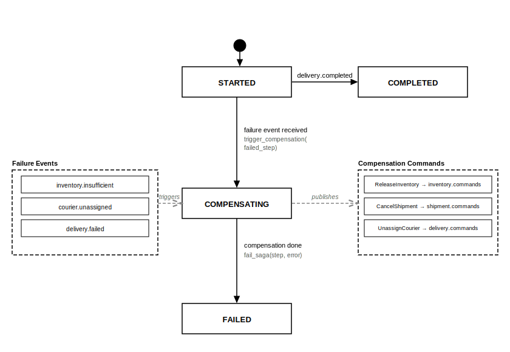

# Supply Chain Tracker

<p align="right">
  <a href="README.md">🇷🇺 Русский</a> | <a href="README.en.md">🇬🇧 English</a>
</p>

<p align="center">
  
  
  
  
  
  
</p>

> Распределённая микросервисная платформа для отслеживания цепочки поставок — от создания отправления до финальной доставки и записи в блокчейн.

---

## Содержание

- [О проекте](#о-проекте)
- [Архитектура](#архитектура)
- [Сервисы](#сервисы)
- [Ключевые технические решения](#ключевые-технические-решения)
- [Технологический стек](#технологический-стек)
- [Структура проекта](#структура-проекта)
- [Быстрый старт](#быстрый-старт)
- [API](#api)
- [Аутентификация и RBAC](#аутентификация-и-rbac)
- [Паттерн Saga](#паттерн-saga)
- [Event-Driven Messaging](#event-driven-messaging)
- [Наблюдаемость](#наблюдаемость)
- [Конфигурация](#конфигурация)
- [Тестирование](#тестирование)
- [CI/CD](#cicd)
- [Дизайн-решения и компромиссы](#дизайн-решения-и-компромиссы)

---

## О проекте

**Supply Chain Tracker** — backend-платформа, моделирующая реальную цепочку поставок в условиях распределённых систем. Проект демонстрирует применение продвинутых паттернов enterprise-архитектуры:

- **Saga Pattern (Orchestration)** — гарантированная компенсация в случае сбоя на любом шаге цепочки без двухфазной фиксации (2PC)
- **Hexagonal Architecture (Ports & Adapters)** — полная изоляция бизнес-логики от инфраструктуры
- **Event-Driven Architecture** — слабая связанность сервисов через Apache Kafka
- **Stateless JWT RBAC** — авторизация без запросов к БД на downstream-сервисах

---

## Архитектура

### Инфраструктура (Docker Compose)

Все сервисы, Kafka, PostgreSQL (отдельная БД на сервис), Redis, Prometheus и Grafana запускаются через единый `docker-compose.yml`.


### Kafka Topics Topology

Три event-топика (публикуют бизнес-события) и три command-топика (saga_coordinator публикует компенсирующие команды).


### Happy Path — последовательность событий

Полный флоу от создания отправления до финальной записи в блокчейн.



---

## Сервисы

| Сервис | Порт | Ответственность | Публикует |
|--------|------|-----------------|-----------|
| **auth_service** | 8005 | Регистрация пользователей, выдача JWT, ротация refresh-токенов | — |
| **delivery_service** | 8000 | Управление курьерами и доставками | `CourierAssigned`, `DeliveryInTransit`, `DeliveryCompleted` |
| **warehouse_service** | 8001 | Складской учёт, резервирование инвентаря | `InventoryReserved`, `InventoryReleased`, `InventoryUpdated` |
| **shipment_service** | 8002 | Создание и трекинг отправлений | `ShipmentCreated`, `ShipmentUpdated`, `ShipmentCancelled` |
| **saga_coordinator** | 8003 | Оркестрация распределённых транзакций, компенсация | `ReleaseInventoryCommand`, `CancelShipmentCommand`, `UnassignCourierCommand` (команды) |
| **blockchain_service** | 8004 | Иммутабельная запись событий в блокчейн | — (только consumer) |

---

## Ключевые технические решения

### Hexagonal Architecture (Ports & Adapters)

Каждый сервис реализует строгое разделение слоёв. Бизнес-логика (`domain/`) не знает ни о FastAPI, ни о PostgreSQL.

```
Зависимости текут в одну сторону:

API handlers → App Services → Domain Ports ← Infra Repositories
                                          ↑
                               asyncpg Pool (via FastAPI Depends)
```

- `domain/entities/` — чистые Python-классы без импортов фреймворков
- `domain/ports/` — абстрактные ABC-интерфейсы репозиториев
- `infra/db/` — конкретные реализации через asyncpg + raw SQL
- `api/handlers/` — HTTP-адаптеры, делегируют всё сервисам

### Stateless JWT Authorization

Downstream-сервисы (delivery, warehouse, shipment) **не обращаются** к `auth_service` при каждом запросе. Они валидируют подпись токена локально и извлекают `role` из claims. Это:
- Устраняет единую точку отказа
- Снижает latency каждого запроса
- Горизонтально масштабируется без изменений

```python
# libs/auth/provider.py
auth_provider = JWTAuthProvider(secret_key=..., stateless=True)
get_current_user = auth_provider()  # FastAPI dependency
```

### Asyncpg без ORM

Все запросы написаны на raw SQL через `asyncpg`. Это даёт:
- Полный контроль над планировщиком запросов
- Отсутствие N+1 и других ORM-ловушек
- Прозрачность — каждый запрос можно объяснить и оптимизировать
- Паттерн UPSERT (`ON CONFLICT DO UPDATE`) для идемпотентности

### Lifespan Resource Management

Все сервисы управляют жизненным циклом ресурсов через `@asynccontextmanager lifespan`:

```python
@asynccontextmanager
async def lifespan(app: FastAPI):
    await db_provider.startup()      # asyncpg connection pool
    await event_queue_provider.startup()  # Kafka / In-Memory adapter
    worker_task = asyncio.create_task(command_worker.run())
    yield                            # приложение принимает запросы
    worker_task.cancel()             # graceful shutdown воркера
    await event_queue_provider.shutdown()
    await db_provider.shutdown()
```

Это гарантирует корректное закрытие соединений и отсутствие goroutine-утечек.

---

## Технологический стек

| Категория | Технология | Обоснование |
|-----------|-----------|-------------|
| **Язык** | Python 3.13 | Последняя стабильная версия, `asyncio.timeout()`, улучшенный GIL |
| **Web Framework** | FastAPI 0.123 | Нативная async-поддержка, автогенерация OpenAPI, dependency injection |
| **База данных** | PostgreSQL 16 | ACID, JSONB для payload, оконные функции |
| **ORM** | asyncpg (raw SQL) | Максимальная производительность, полный контроль над запросами |
| **Миграции** | yoyo-migrations | Версионируемые SQL-миграции, откат, нумерация |
| **Message Broker** | Apache Kafka + aiokafka | At-least-once delivery, log-based хранение, партиционирование |
| **Аутентификация** | python-jose + bcrypt | HS256 JWT, PBKDF2 password hashing |
| **Блокчейн** | Web3.py | EVM-совместимые сети, mock-режим для разработки |
| **Кэш** | Redis 7 | Nonce-менеджер для блокчейн-транзакций |
| **Метрики** | Prometheus + Grafana | request rate, error rate, latency percentiles |
| **Логирование** | Структурированный JSON | correlation_id сквозь все сервисы |
| **Инфраструктура** | Docker Compose | Воспроизводимое окружение, health checks |
| **CI/CD** | GitHub Actions | Тесты, линтинг, docker build per service |
| **Линтинг** | ruff | В 100x быстрее flake8, поддерживает isort |

---

## Структура проекта

```
supply_chain_tracker/
│
├── infra/                          # Инфраструктурные конфиги
│   ├── docker-compose.yml          # PostgreSQL, Kafka, Redis, Prometheus, Grafana
│   ├── prometheus/prometheus.yml   # Scrape-конфиг
│   └── grafana/
│       ├── dashboards/             # JSON-дашборды (auto-provisioned)
│       └── provisioning/           # Datasource + dashboard discovery
│
├── libs/                           # Общая библиотека всех сервисов
│   └── libs/
│       ├── auth/                   # JWT provider, RBAC, TokenPayload
│       ├── cache/                  # Redis + In-Memory адаптеры
│       ├── deps/                   # PostgresPoolProvider, EventQueueProvider
│       ├── errors/                 # handlers.py — фабрика exception handlers
│       ├── health/                 # create_health_router(), PostgresHealthCheck
│       ├── messaging/              # Event/Command dataclasses, Kafka/Memory adapters
│       ├── middlewares/            # HttpLoggingMiddleware
│       └── observability/          # JSON-логгер, PrometheusMiddleware
│
└── services/
    ├── auth_service/               # Регистрация, JWT, refresh-токены
    ├── delivery_service/           # Курьеры и доставки
    ├── warehouse_service/          # Склады и инвентарь
    ├── shipment_service/           # Отправления
    ├── saga_coordinator/           # Distributed saga orchestration
    └── blockchain_service/         # On-chain event recording
```

### Структура каждого сервиса

```
services/<service>/
├── Dockerfile
├── pyproject.toml
├── migrations/
│   └── 001_create_table.py        # yoyo migration
└── src/
    ├── config.py                   # Pydantic Settings
    ├── main.py                     # FastAPI app + lifespan
    ├── domain/
    │   ├── entities/               # Чистые domain models
    │   ├── ports/                  # ABC repository interfaces
    │   ├── errors/                 # Domain exceptions
    │   └── value_objects/          # Immutable value types
    ├── app/
    │   ├── services/               # Application services
    │   └── workers/                # Kafka command consumers
    ├── infra/
    │   └── db/                     # asyncpg repository implementations
    └── api/
        ├── handlers/               # FastAPI routers
        ├── dto/                    # Pydantic request/response models
        ├── mappers/                # Entity ↔ DTO conversion
        └── deps/                   # FastAPI dependency providers
```

---

## Быстрый старт

### Требования

- Docker 24+
- Docker Compose v2
- Make

### Запуск

```bash
# 1. Клонировать репозиторий
git clone <repo-url>
cd supply_chain_tracker

# 2. Создать .env файлы для каждого сервиса
cp infra/env.example services/auth_service/.env
cp infra/env.example services/delivery_service/.env
cp infra/env.example services/warehouse_service/.env
cp infra/env.example services/shipment_service/.env
cp infra/env.example services/saga_coordinator/.env

# 3. Запустить всю инфраструктуру
make up

# 4. Проверить статус контейнеров
make ps
```

### Применение миграций

```bash
# Для каждого сервиса
make migrate-delivery_service
make migrate-warehouse_service
make migrate-shipment_service
make migrate-auth_service
make migrate-saga_coordinator
make migrate-blockchain_service
```

### Остановка

```bash
make down
```

### Полезные команды

```bash
make logs                          # все логи
make logs service=delivery_service # логи одного сервиса
make build                         # пересобрать образы
make ps                            # статус контейнеров
```

---

## API

Документация Swagger доступна в режиме `development`:

| Сервис | Swagger UI |
|--------|-----------|
| auth_service | http://localhost:8005/docs |
| delivery_service | http://localhost:8000/docs |
| warehouse_service | http://localhost:8001/docs |
| shipment_service | http://localhost:8002/docs |
| saga_coordinator | http://localhost:8003/docs |

### Регистрация и получение токена

```bash
# Регистрация
curl -X POST http://localhost:8005/api/v1/auth/register \
  -H "Content-Type: application/json" \
  -d '{"username": "alice", "email": "alice@example.com", "password": "secret123"}'
# → 201 {"user_id": "...", "username": "alice", "role": "operator"}

# Получение токенов
curl -X POST http://localhost:8005/api/v1/auth/token \
  -d "username=alice&password=secret123"
# → {"access_token": "eyJ...", "refresh_token": "...", "token_type": "bearer"}

# Обновление токена
curl -X POST http://localhost:8005/api/v1/auth/refresh \
  -H "Content-Type: application/json" \
  -d '{"refresh_token": "<refresh_token>"}'
```

### Основные операции

```bash
TOKEN="Bearer eyJ..."

# Создать курьера
curl -X POST http://localhost:8000/api/v1/couriers \
  -H "Authorization: $TOKEN" \
  -H "Content-Type: application/json" \
  -d '{"first_name": "Ivan", "last_name": "Petrov", "phone": "+79001234567"}'

# Список курьеров (с пагинацией)
curl "http://localhost:8000/api/v1/couriers?limit=20&offset=0" \
  -H "Authorization: $TOKEN"

# Создать отправление
curl -X POST http://localhost:8002/api/v1/shipments \
  -H "Authorization: $TOKEN" \
  -H "Content-Type: application/json" \
  -d '{
    "origin": "Moscow",
    "destination": "Saint Petersburg",
    "departure_date": "2026-04-01"
  }'

# Создать склад
curl -X POST http://localhost:8001/api/v1/warehouses \
  -H "Authorization: $TOKEN" \
  -H "Content-Type: application/json" \
  -d '{"name": "Warehouse A", "address": "Moscow, Industrialnaya 5"}'

# Удалить (только admin)
curl -X DELETE http://localhost:8000/api/v1/couriers/<id> \
  -H "Authorization: $ADMIN_TOKEN"
# operator → 403, admin → 204
```

### Health Checks

```bash
# Liveness probe
curl http://localhost:8000/api/v1/health
# → {"service": "delivery_service", "status": "HEALTHY"}

# Readiness probe (проверяет DB, Kafka)
curl http://localhost:8000/api/v1/ready
# → {"service": "delivery_service", "status": "HEALTHY", "components": {...}}
```

---

## Аутентификация и RBAC

### Схема токенов

```
JWT payload:
{
  "sub": "alice",
  "role": "operator",   ← claim используется для RBAC
  "exp": 1234567890
}
```

### Матрица прав

| Роль | GET | POST / PATCH | DELETE |
|------|-----|-------------|--------|
| `viewer` | + | - 403 | - 403 |
| `operator` | + | + | - 403 |
| `admin` | + | + | + |

### Как работает stateless авторизация

```
Client → delivery_service → JWTAuthProvider.decode_token()
                            ↓
                   Верификация подписи HMAC-SHA256
                            ↓
                   Извлечение role из claims
                            ↓
                   require_role("admin") → 403 или pass
```

**Нет вызова к `auth_service`** на каждый запрос. Секрет JWT разделяется через переменную окружения `JWT_SECRET_KEY`.

---

## Паттерн Saga

### Зачем Saga вместо 2PC?

Двухфазная фиксация (2PC) блокирует ресурсы на время подготовки всех участников, что неприемлемо при микросервисной архитектуре. Saga реализует компенсируемые транзакции — каждый шаг имеет обратную операцию.

### Жизненный цикл Saga



| Статус | Описание |
|--------|----------|
| `STARTED` | Сага создана, шаги выполняются |
| `COMPLETED` | Все шаги завершены успешно |
| `COMPENSATING` | Обнаружен сбой, выполняется откат |
| `FAILED` | Компенсация завершена, сага провалена |

### Таблица компенсаций

| Сбой | Компенсирующие команды |
|------|------------------------|
| `delivery.failed` | `UnassignCourierCommand` + `ReleaseInventoryCommand` + `CancelShipmentCommand` |
| `courier.unassigned` | `ReleaseInventoryCommand` + `CancelShipmentCommand` |
| `inventory.insufficient` | `CancelShipmentCommand` |

### correlation_id

Каждое событие и команда несут `correlation_id` (saga_id), что позволяет:
- Связывать все события одной саги
- Осуществлять идемпотентную обработку
- Строить трейсы в распределённом трейсинге

```python
event = Event(
    event_type="shipment.created",
    aggregate_id=shipment_id,
    correlation_id=saga_id,   # ← сквозной идентификатор
    payload={...}
)
```

---

## Event-Driven Messaging

Полная топология топиков — в диаграмме [Kafka Topics](docs/kafka-topics.drawio.svg).

### Переключение Kafka ↔ In-Memory

Все сервисы поддерживают локальную разработку без Kafka:

```bash
# .env
USE_KAFKA=false   # In-Memory (для тестов и локалки)
USE_KAFKA=true    # Apache Kafka (production / docker-compose)
```

Реализовано через `EventQueueProvider` в `libs/deps/queue.py` — единая точка конфигурации.

---

## Наблюдаемость

### Prometheus + Grafana

```bash
# Prometheus
open http://localhost:9090

# Grafana (admin / admin)
open http://localhost:3000
```

Dashboard **"Supply Chain Tracker"** доступен сразу после запуска (auto-provisioned). Включает:
- **HTTP Request Rate** — req/s по сервисам
- **Error Rate 5xx** — процент ошибок
- **Latency P99 / P50** — персентили задержки в мс
- **Stat panels** — active services, total requests, error %

### Метрики

Каждый сервис экспортирует метрики на `/metrics` (формат Prometheus):

```
http_requests_total{service, method, path, status}
http_request_duration_seconds{service, method, path}
```

### Структурированные логи

Все логи — JSON с обязательными полями:

```json
{
  "timestamp": "2026-03-10T12:00:00Z",
  "level": "INFO",
  "service": "delivery_service",
  "correlation_id": "550e8400-e29b-41d4-a716-446655440000",
  "message": "Processing command",
  "command_type": "courier.unassign"
}
```

`correlation_id` прокидывается сквозь все сервисы, позволяя трейсить полный путь запроса.

---

## Конфигурация

Все настройки — через переменные окружения (Pydantic Settings):

| Переменная | Сервисы | По умолчанию | Описание |
|-----------|---------|-------------|----------|
| `DATABASE_URL` | все | — | PostgreSQL DSN |
| `JWT_SECRET_KEY` | все | `dev-secret` | Общий HS256-секрет |
| `JWT_ALGORITHM` | все | `HS256` | Алгоритм подписи |
| `JWT_ACCESS_TOKEN_EXPIRE_MINUTES` | все | `60` | TTL access token |
| `REFRESH_TOKEN_EXPIRE_DAYS` | auth_service | `30` | TTL refresh token |
| `USE_KAFKA` | delivery/warehouse/shipment/saga | `false` | Kafka vs In-Memory |
| `KAFKA_BOOTSTRAP_SERVERS` | все | `localhost:9092` | Kafka brokers |
| `KAFKA_GROUP_ID` | все | per-service | Consumer group |
| `DB_POOL_MIN_SIZE` | все | `5` | Мин. соединений |
| `DB_POOL_MAX_SIZE` | все | `20` | Макс. соединений |
| `USE_MOCK_BLOCKCHAIN` | blockchain_service | `false` | Mock Web3 gateway |
| `REDIS_URL` | blockchain_service | `redis://localhost` | Nonce manager |
| `ENVIRONMENT` | все | `development` | local/development/production |

Пример `.env` — в `infra/env.example`.

---

## Тестирование

### Запуск тестов

```bash
# Тесты одного сервиса
make test-delivery_service

# Тесты всех сервисов
make test-all

# С покрытием
make coverage-delivery_service
```

### Структура тестов

```
tests/
└── unit/
    ├── api/
    │   ├── test_courier_router.py    # HTTP handler tests
    │   ├── test_delivery_router.py
    │   └── test_auth.py              # Auth middleware tests
    └── infra/
        └── repositories/
            ├── test_courier_repository.py   # Repository tests
            └── test_delivery_repository.py
```

### Паттерн тестирования

Каждый тест создаёт изолированный экземпляр FastAPI — **без импорта `src.main`**. Это гарантирует независимость тестов от lifespan и даёт возможность переопределить зависимости:

```python
def test_create_courier():
    app = FastAPI()
    app.include_router(courier_router)
    # Override auth dependency
    app.dependency_overrides[get_current_user] = lambda: UserInDB(username="alice", role="operator")

    client = TestClient(app)
    response = client.post("/couriers", json={...})
    assert response.status_code == 201
```

Репозитории тестируются с мок-пулом asyncpg — без реального соединения с БД.

---

## CI/CD

### GitHub Actions Pipeline

`.github/workflows/ci.yml` содержит три job-а:

```
push/PR → main
    │
    ├── test (matrix: все сервисы)
    │   ├── poetry install
    │   ├── pytest --cov
    │   └── upload coverage → Codecov
    │
    ├── lint
    │   └── ruff check (все сервисы)
    │
    └── build (matrix: все сервисы)
        └── docker build
```

### Pre-commit хуки

```bash
# Установка
pip install pre-commit
pre-commit install

# Ручной запуск
pre-commit run --all-files
```

Хуки: `ruff` (lint + format), `trailing-whitespace`, `end-of-file-fixer`, `check-yaml`, `debug-statements`.

### Makefile

```bash
make up                        # запустить все сервисы
make down                      # остановить
make build                     # пересобрать Docker-образы
make logs service=delivery_service  # логи конкретного сервиса
make ps                        # статус контейнеров

make test-delivery_service     # тесты сервиса
make test-all                  # тесты всех сервисов
make coverage-warehouse_service # покрытие

make lint-shipment_service     # ruff check
make lint-all                  # линтинг всех сервисов

make migrate-delivery_service  # применить миграции
make install-all               # poetry install для всех сервисов
```

---

## Дизайн-решения и компромиссы

### Почему не 2PC / XA-транзакции?

Двухфазная фиксация требует блокировки ресурсов всех участников на время подготовки. В микросервисной архитектуре это создаёт tight coupling и снижает availability. Saga Pattern + компенсирующие транзакции дают eventual consistency без распределённых блокировок.

### Почему stateless JWT вместо сессий?

Stateful-сессии требуют общего хранилища (Redis) и дополнительного round-trip на каждый запрос. Stateless JWT позволяет каждому сервису самостоятельно валидировать авторизацию — горизонтальное масштабирование без изменений.

### Почему raw SQL вместо SQLAlchemy?

В проекте используется asyncpg напрямую. SQLAlchemy добавляет уровень абстракции, который скрывает генерируемые запросы и усложняет оптимизацию. Raw SQL — предсказуем, прозрачен, и при правильной организации (repository pattern) не менее поддерживаем.

### Почему In-Memory адаптер для Kafka?

Заменяемые адаптеры очереди (`EventQueuePort`) позволяют запускать весь сервис без Kafka в тестах и локальной разработке — достаточно `USE_KAFKA=false`. Переключение не требует изменения бизнес-кода.
